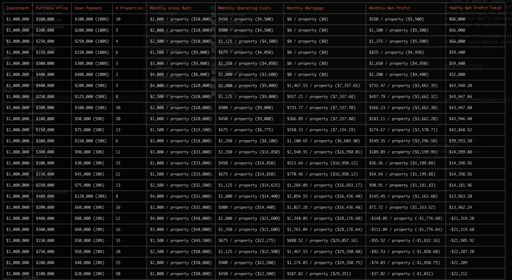

# Housing Scenarios

### About

This is a simple tool to run different scenarios for purchasing investment properties. It takes in several inputs (investment amount, operating costs, interest rates, etc) as well as different scenarios (purchase price, down payment percentage) and generates a matrix of parameters. From there it determines what's the ideal strategy, assuming you used the same strategy for purchasing all the properties.

<p align="center">
  
</p>

### Install

> git clone git@github.com:ishmaelthedestroyer/real-estate-scenarios.git
> yarn install

### Configure

- Edit constants in `src/constants.ts`
  - initial investment amount
  - percentage rent from purchase price
  - operating cost percent
  - interest rate
- Edit inputs in `src/inputs.ts`

### Run

```
yarn start:dev
```
